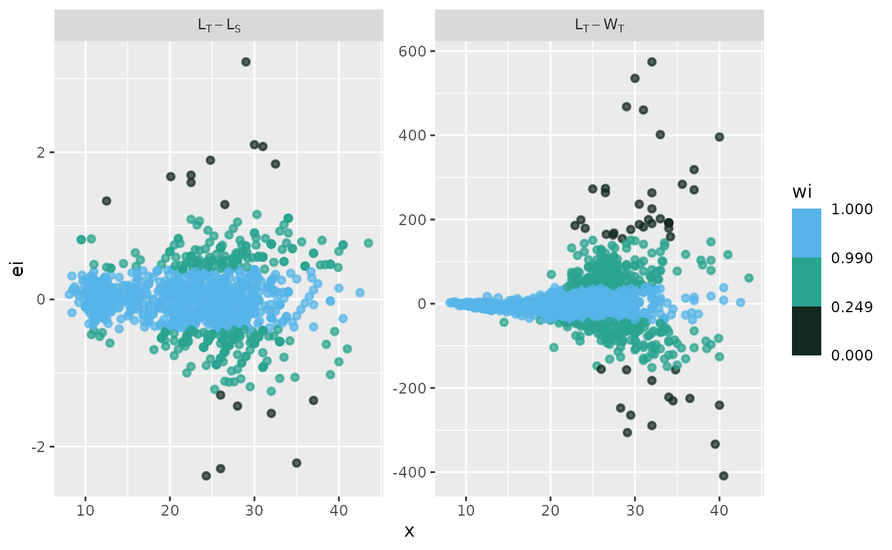
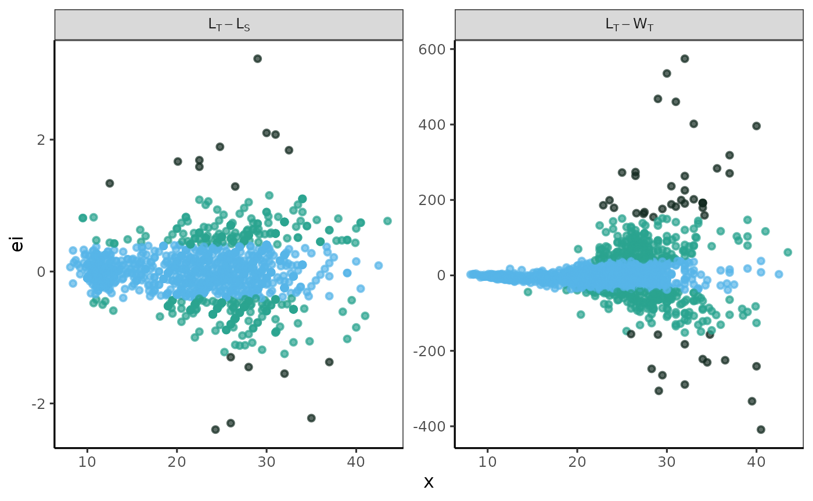
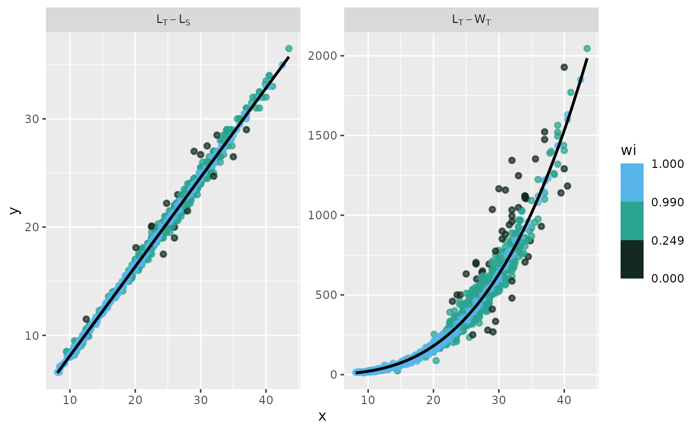
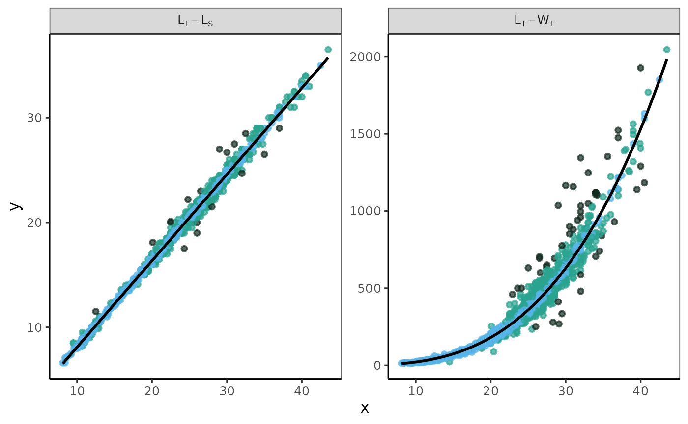
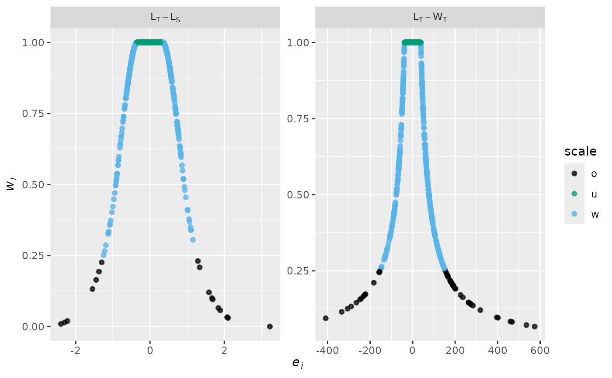
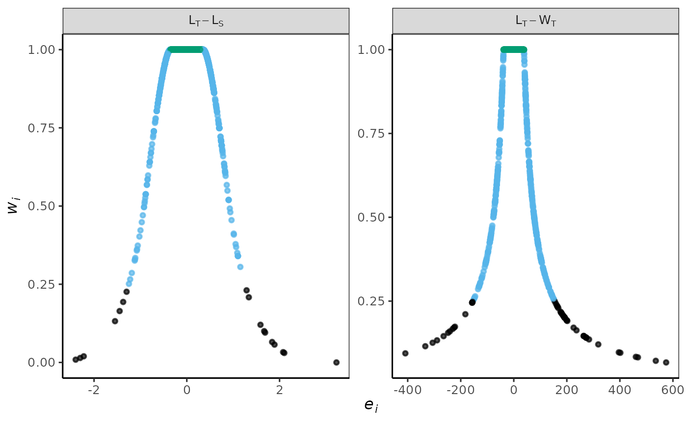

# Example-Analysis

``` r

library(Morefi)
```

Shield: [](http://creativecommons.org/licenses/by/4.0/)

Morefi © 2024 by Hugo Aguirre Villaseñor is licensed under a [Creative
Commons Attribution 4.0 International
License](http://creativecommons.org/licenses/by/4.0/).

[](http://creativecommons.org/licenses/by/4.0/)

## Morefi: Example Analysis

This a methodological package developed in R. It includes functions that
support data analysis and ensure reproducibility of the results reported
in the article by Aguirre-Villaseñor *et al.* (2025).

In fisheries monitoring, body length is the most commonly measured
parameter because it is quick and easy to obtain. In contrast, measuring
weight requires a level and stable scale, which can be difficult to
secure in field sampling. Biometric relationships are crucial in
fisheries biology. When accurately calculated, these relationships can
be very useful for management purposes, especially for estimating an
organism’s total length or weight based on other body measurements.

Many species are marketed through artisanal fishing in various
commercial forms. However, there are currently no biometric
relationships that allow for predicting live weight (the total weight of
the fish) from the different categories of landed weight, such as fillet
weight, gutted weight, or frozen weight.

The objective of this package is to provide quantitative analysis for
various morphological relationships that help predict: a) the expected
live weight of different landed weight categories, b) the expected
fillet yield from various commercial presentations, and c) testing the
suitability of fillet yield as a reference point in managing the target
species.

For this purpose, some functions and a vignette were created to explain
the process step by step. Its implementation streamlines the methodology
and enhances the clarity and impact of both the results and graphical
presentations (tables and figures are personalized).

The functions included in the Morefi package enable the evaluation of
length-length, weight-weight and length-weight biometric relationships
using data that exhibit high variability and do not meet the assumptions
necessary for adjustment via least squares. Given this variability, a
robust regression method is employed for analysis. The “robustbase”
package (version 0.99-2) was utilized to fit robust regression models,
using the functions lmrob() for linear and nlrob() for non-linear
regression (Maechler *et al*., 2024).

## Installation

You can install the development version of Morefi from
[GitHub](https://github.com/Macrurido/Morefi.git) using one of the
following options:

Using the **pak** package

``` r

# install.packages("pak")
pak::pak("Macrurido/Morefi")
```

or using the **devtools** package

``` r

library(devtools)
install_github("Macrurido/Morefi")
```

### Data available in the package

The package contains two data sets. Data are available under the terms
of the [The Creative Commons Attribution 4.0 International (CC BY
4.0)](https://creativecommons.org/licenses/by/4.0/legalcode).

#### Bullseye puffer measures

To demonstrate how the package functions, we utilize the dataset
`botete`, containing 1,397 fish across 7 variables: the total
length(LT), standard length (SL), body trunk length (LB), total weight
(WT), body trunk weight (WB), fillet weight (Wfi) and Fleet of the
bullseye puffer (*Sphoeroides annulatus*), collected from the Eastern
Central Pacific. In this dataset, the landing category is included in
the “Fleet” variable, which is categorized as follows: 1 indicates
Fresh, while 2 denotes Frozen-thawed. This biometric data file, is
included in the package with permission from the Instituto Mexicano de
Investigación en Pesca y Acuacultura Sustentables (Mexican Institute for
Research in Sustainable Fishing and Aquaculture).

To access the data file, the data frame is stored in an object, such as
‘mydata’.

``` r

mydata <- Morefi::Botete
str(mydata)
#> 'data.frame':    1397 obs. of  7 variables:
#>  $ LT   : num  21 22 12 21 12 28.4 29.3 34.8 31.7 31.5 ...
#>  $ LS   : num  17.3 17.6 10 17.3 10 23 24.2 27.5 25.5 26 ...
#>  $ LB   : num  17 15 10 15 8.5 20 20.5 27 23 24 ...
#>  $ WT   : num  189.1 213.4 33.4 236.7 36 ...
#>  $ WB   : num  115.6 86.7 15.4 100.4 18.9 ...
#>  $ Wfi  : num  50.7 55.5 6.9 65 9.1 ...
#>  $ Fleet: Factor w/ 2 levels "1","2": 2 2 2 1 2 1 2 1 1 1 ...
```

### Bullseye puffer fish landings

A second dataset `Botete_land`, provided the Mexican fishing records of
bullseye puffer landed on the Pacific coast in 2023 and their live
weight corresponding live weight for each weight category (kg): total
(WT), body trunk (WB) or fillet (Wfi), either Fresh or Frozen-thawed
(SIPESCA, 2024).

To access the data file, the data frame is stored in `catch`.

``` r

catch <- Morefi::Botete_land
catch
#>          Category  Landed   Biomass    Pesos  Pesos_kg
#> 1        WT_Fresh  509354  509354.0  33079.5  41.49873
#> 2        WB_Fresh  449646  494610.6  58048.0  52.05232
#> 3 WB_Fresh_Thawed  361404  451755.0  37997.0  54.77369
#> 4       Wfi_Fresh   47990   95980.0  16485.0 112.83715
#> 5           Total 1368394 1551699.6 145609.5  50.97446
```

## theme_papers()

The
[`theme_papers()`](https://macrurido.github.io/Morefi/reference/theme_papers.md)
is created to standardize the graphic format, used as base
[`theme_bw()`](https://ggplot2.tidyverse.org/reference/ggtheme.html). To
showcase their design, this manual presents graphics in both their
original format and the format created using the
[`theme_papers()`](https://macrurido.github.io/Morefi/reference/theme_papers.md).

To call the
[`theme_papers()`](https://macrurido.github.io/Morefi/reference/theme_papers.md)
function use the following statement:

``` r

theme_papers <- Morefi::theme_papers()
```

## Values to define for the examples

[Esto no lo se Rick](#No_lo_se_Rick)

The following objects, data frames, and lists will be utilized in
multiple examples to avoid repetition of information.

### List: modelos

A list that defines the variables that will be taken into account for
the model.

``` r

modelos <- list (LTvs.LS  =  c(1,2),
                 LTvs.WT  =  c(1,4))
```

## Morefi functions

The Morefi package includes functions that facilitate data analysis and
ensure reproducibility of results. The functions for analysis are
outlined below, followed by the functions for plotting.

### Analysis functions

#### fn_ARSS()

The function
[`fn_ARSS()`](https://macrurido.github.io/Morefi/reference/fn_ARSS.md)
perform the Coincident Curves Test, to determine if there are
significant differences between the fitted curves for each database. It
is based on the Analysis of the Residual Sum of Squares (ARSS) (Chen et
al. 1992).

``` math
F=\frac{\frac{RSS_{p}-RSS_{s}}{3\bullet \left( K-1 \right)}}{\frac{RSS_{s}}{N-3\bullet K}}
```

$`RSS_{p}= RSS`$ of each regression fitted by pooled data, $`RSS_{s}`$=
sum of the $`RSS`$ of each regression fitted for each individual sample,
$`N`$= total sample size, and $`K`$ = number of samples in the
comparison.

The residual sum of squares $`RSS`$ and the degrees of freedom $`DF`$
for each fitted regression are previously stored in the `List_TCCT`
list. For each regression, the calculations are stored in a data frame
`T1`, which is stored iteratively using a loop for in a list `T`.

Inside the function, the RSS and DF for the joined sample are calculated
to perform the F test for two tails $`\alpha/2`$. The decision criteria
is performed: “\*” if $`p-value\le \alpha`$ or “NS” if the
$`p-val\gt \alpha`$.

The function requires defining:

- `List_TCCT`: A list with fitted regression results.  
- `i`: An integer value indicating the ith regression analyzed.
- `alfa`: A numerical value that defines the significance level. The
  default number is 0.05.

The function return a data frame containing the results of the
Coincident Curves Test stored in a list.

##### Example

The Total length (LT) - Total weight (WT) was estimated for the bullseye
puffer *Sphoeroides annulatus* for landed categories: Fresh,
Frozen-thawed (Frozen), Total (All sample) and Joined (sum of values of
Fresh and Frozen). The Residual Sum of Squares (RSS) and the degrees of
freedom (DF) are provided for each data source. In the table the first
row displays the Analysis of Residual Sum of Squares (ARSS), the p-value
(p), and the decision criteria for the ARSS test (Criteria).

In the table the first row displays the Analysis of Residual Sum of
Squares (ARSS), the p-value (p), and the decision criteria for the ARSS
test (Criteria).

The adjusted models show the following data: Fresh SSR= and DF= 742;
Frozen SSR= 1280131.81 and DF= 651; and the total sample SSR= 6115874.53
and DF= 1395. Values are stored in the table `Table_CC`, this is stored
in a list, and the name of each item is built with the acronyms of the
model variables (e.g. LTWT).

``` r

Table_CC <- data.frame(matrix(NA,nrow=4,ncol=8))
Table_CC[1,1] <- "Lt-WT" 
Table_CC[,2] <- c("Fresh","Frozen","Total","Joined")
colnames(Table_CC) <- c("Model","Category","RSS","DF","ARSS","F-table","p-value","Criteria")

Table_CC[1,3] <- 4424418.33
Table_CC[1,4] <-  742 
Table_CC[2,3] <- 1280131.81
Table_CC[2,4] <-  651 
Table_CC[3,3] <- 6115874.53
Table_CC[3,4] <-  1395 

List_ARSS <- list(LTWT=Table_CC)

i <- 1

ARSS <- fn_ARSS(List_ARSS, i,  alfa= 0.05)
```

| Model     | Category |     RSS |   DF |   ARSS | F-table | p-value | Criteria |
|:----------|:---------|--------:|-----:|-------:|--------:|:--------|:---------|
| LT vs. WT | Fresh    | 4424418 |  742 | 0.0721 |  1.0921 | 0.05007 | NS       |
| NA        | Frozen   | 1280132 |  651 |     NA |      NA | NA      | NA       |
| NA        | Total    | 6115875 | 1395 |     NA |      NA | NA      | NA       |
| NA        | Joined   | 5704550 | 1393 |     NA |      NA | NA      | NA       |

Table of the Coincident Curve Test. {.table}

> **ⓘ** To enhance the visualization of the function results, tables and
> their headers were constructed using the knitr and kableExtra
> packages. The code is not displayed.

#### fn_dfa()

This function uses the `augment()` function from the `broom` package to
extract the observed values of the independent variable (x) and
dependent variable (y), along with the weights (wi), fitted values
(fitt), and residuals (ei) from the summary of the fitted model. It then
turns these components into tidy tibbles.

The function `augment()` does not provide the weights column for the
`lmrob()` function. The function
[`fn_dfa()`](https://macrurido.github.io/Morefi/reference/fn_dfa.md)
contains a conditional statement that includes this variable in the
output data frame of the linear adjustments.

In order to homogenizes the results, the columns names were renamed as
“y”, “wi”,“x”,“fitt”,and “ei”.

An additional column has been included that codes errors using a scale
based on weighted values: unweighted (u), weighted (w), and outliers (o)
`dfa$scale <- ifelse(df$wi < 0.25, "o", ifelse(df$wi<1, "w", "u"))`.

The function requires defining:

- `eq`: Summary of the equation fitted.

##### Example

Using the biometric data from `Morefi::botete`, a linear relationship
between Total Length and Standard Length (LT_LS) was established using
the [`robustbase::lmrob`](https://rdrr.io/pkg/robustbase/man/lmrob.html)
function. Additionally, the relationship between Total Length and Total
Weight (LT_WT) was fitted using the `robustbase::nlm` function, with an
input y-value of a = 0.1 and a slope of b = 3.

For optimal functionality of
[`fn_dfa()`](https://macrurido.github.io/Morefi/reference/fn_dfa.md),
the data frames used for fitting relationships must be formatted as
tibble.

``` r

library(dplyr)
library(tibble)

df <- dplyr::tibble(x1 = mydata[,1],
                y1 = mydata[,2])

eq1 <- robustbase::lmrob(y1 ~ x1, data= df,
                                  setting = "KS2014",
                                              doCov = TRUE)
dfa1 <- fn_dfa(eq= eq1)

#  Power Model
df <- dplyr::tibble(x1 = mydata[,1],
                y1 = mydata[,4])

a=0.01
b=3

eq2 <- robustbase::nlrob(y1 ~ a*x1^b, data= df,
                        start = list(a= a, b= b),
                        trace = FALSE)

dfa2 <- fn_dfa(eq= eq2)
```

|    y |    x |      fitt |         ei |        wi | scale |
|-----:|-----:|----------:|-----------:|----------:|:------|
| 17.3 | 21.0 | 17.174230 |  0.1257696 | 1.0000000 | u     |
| 17.6 | 22.0 | 17.999109 | -0.3991088 | 0.9914912 | w     |
| 10.0 | 12.0 |  9.750324 |  0.2496758 | 1.0000000 | u     |
| 17.3 | 21.0 | 17.174230 |  0.1257696 | 1.0000000 | u     |
| 10.0 | 12.0 |  9.750324 |  0.2496758 | 1.0000000 | u     |
| 23.0 | 28.4 | 23.278331 | -0.2783310 | 1.0000000 | u     |

The first six rows of the table are displayed, based on the LT versus LS
relationship results. {.table}

|     y |        wi |    x |      fitt |        ei | scale |
|------:|----------:|-----:|----------:|----------:|:------|
| 189.1 | 1.0000000 | 21.0 | 209.81549 | -20.71549 | u     |
| 213.4 | 1.0000000 | 22.0 | 242.19890 | -28.79890 | u     |
|  33.4 | 1.0000000 | 12.0 |  37.32321 |  -3.92321 | u     |
| 236.7 | 1.0000000 | 21.0 | 209.81549 |  26.88451 | u     |
|  36.0 | 1.0000000 | 12.0 |  37.32321 |  -1.32321 | u     |
| 457.0 | 0.5098231 | 28.4 | 532.50610 | -75.50610 | w     |

The first six rows of the table are displayed, based on the LT versus WT
relationship results. {.table}

> **ⓘ** To enhance the visualization of the function results, tables and
> their headers were constructed using the knitr and kableExtra
> packages. The code is not displayed.

#### fn_freq()

It is used as an internal function within
[`fn_freqw()`](https://macrurido.github.io/Morefi/reference/fn_freqw.md).

The
[`fn_freq()`](https://macrurido.github.io/Morefi/reference/fn_freq.md)
function calculates a frequency distribution of data using the
[`cut()`](https://rdrr.io/r/base/cut.html) and
[`table()`](https://rdrr.io/r/base/table.html) functions from the R
base. It produces a data frame that displays frequencies categorized by
class interval.

Within the function, the non-cumulative absolute frequency is calculated
for each user-defined class interval based on the `breaks` object. The
`breaks` object must be defined outside the function by the user.

The attributes and examples of
[`fn_freq()`](https://macrurido.github.io/Morefi/reference/fn_freq.md)
are detailed in the documentation for the
[`fn_freqw()`](https://macrurido.github.io/Morefi/reference/fn_freqw.md)
function below.

**See also** [`cut()`](https://rdrr.io/r/base/cut.html) and
[`table()`](https://rdrr.io/r/base/table.html) from the R base package.

#### fn_freqw()

The
[`fn_freqw()`](https://macrurido.github.io/Morefi/reference/fn_freqw.md)
calculate the percentage frequencies of weights by model adjusted using
the robust regression approach. The function calculates the relative
frequency distribution using the function
[`fn_freq()`](https://macrurido.github.io/Morefi/reference/fn_freq.md)
from `Morefi` package. It returns a table with frequencies by class
interval.

The breaks object must be defined. To incorporate the number of
non-weighted values $`(w_{i}=1)`$, a class interval “1” is added to the
sequence inside the function.

The function requires defining:

- `df` A vector of data values.
- `breaks` A vector with class intervals.
- `right` Logical, indicating if the intervals should be closed on the
  right (and open on the left) or vice versa.

**See also**
[`Morefi::fn_freq`](https://macrurido.github.io/Morefi/reference/fn_freq.md);
[`cut()`](https://rdrr.io/r/base/cut.html) and
[`table()`](https://rdrr.io/r/base/table.html) from the R base package.

##### Example

The weighted values were obtained from the summary of linear and power
models fitted using robust regression and stored in `dfa1` and `dfa2`,
which were generated with the
[`fn_dfa()`](https://macrurido.github.io/Morefi/reference/fn_dfa.md)
example. In each data frame, the weighted values are stored in the
column labeled “wi.”

The function
[`fn_freqw()`](https://macrurido.github.io/Morefi/reference/fn_freqw.md)
calculates the frequency of weighted values within a defined interval
based on a weighted scale classification: unweighted $`(w_{i}=1)`$,
weighted $`(1>w_{i}≥0.25)`$, and outliers $`(w_{i}<0.25)`$. The weighted
scale is stored in `breaks`.

``` r

breaks  <-  c(0,0.25,1,Inf) # Weighted scale

df <- dfa1$wi    # Data frame 1
freq1 <- fn_freqw(df, breaks, right=FALSE)

df <- dfa2$wi    # Data frame 2
freq2 <- fn_freqw(df, breaks, right=FALSE)

# Merging the two data sets (as example) 
freqw <- as.data.frame(t(cbind(freq1, freq2)))
```

|       | \[0,0.25) | \[0.25,1) | \[1,Inf) |
|:------|----------:|----------:|---------:|
| freq1 |  1.216893 |  30.06442 | 68.71868 |
| freq2 |  3.364352 |  27.05798 | 69.57767 |

Percentage frequencies of weights (wi) based on a weighted scale
classification {.table}

> **ⓘ** To enhance the visualization of the function results, tables and
> their headers were constructed using the knitr and kableExtra
> packages. The code is not displayed.

#### fn_xseq()

The function creates a data frame containing a sequence for the selected
independent variable based on the model. The lower end of the range is
determined by rounding down the minimum value to the nearest multiple of
the specified “bin” step size, while the upper end is determined by
rounding up the maximum value.

The data frame should have the same column name as the dependent
variable used in the fitted model.

The function requires defining:

- `df` A data frame includes the morphological variables.
- `modelos` A list defining the numerical column variables for the
  model.
- `bin` A vector contains the step size for each independent variable in
  every model.
- `i` An integer value indicating the regression to be analyzed.

The function returns a one-column data frame with the sequence selected.

##### Example

Using biometric data from `Morefi::botete`, the sequence of independent
variables for the relationships between Total Length and Standard Length
(LT_LS) and between Total Length and Total Weight (LT_WT) was computed
using the function `fn_xseq`.

The object `modelos` was defined earlier in the section titled **Values
to Define for the Examples**.

``` r

df <- mydata
bin <- c(2)
i=1
xseq1 <- fn_xseq(df, modelos, bin, i)

bin <- c(5)
i=2
xseq2 <- fn_xseq(df, modelos, bin, i)
```

|     |   1 |   2 |   3 |   4 |   5 |   6 |   7 |   8 |   9 |
|:----|----:|----:|----:|----:|----:|----:|----:|----:|----:|
| x1  |   8 |  10 |  12 |  14 |  16 |  18 |  20 |  22 |  24 |
| x1  |   5 |  10 |  15 |  20 |  25 |  30 |  35 |  40 |  45 |

The first nine columns of the table are displayed, based on the sequence
of independent variables for the relationships between Total Length and
Standard Length (LT_LS), and between Total Length and Total Weight
(LT_WT). {.table}

> **ⓘ** To enhance the visualization of the function results, tables and
> their headers were constructed using the knitr and kableExtra
> packages. The code is not displayed.

#### fn_intervals()

The function calculates a non-parametric confidence and predicted
intervals using the function predFit() from the package investr (version
1.4.2).

The function requires defining:

- `xseq` A vector with a sequence for independent variable.
- `eq` Summary of the equation fitted.

The function return a data frame `df` with the xseq (x1), the fitted
values for dependent variable (fit), the low and upper confident (IC_L
and IC_U) and predicted intervals (IP_L and IP_U).

##### Example

``` r


eq <- eq1
xseq <- xseq1
CI <- fn_intervals(eq,xseq)
```

|  x1 |       fit |      CI_L |      CI_U |      PI_L |      PI_U |
|----:|----------:|----------:|----------:|----------:|----------:|
|   8 |  6.450810 |  6.405704 |  6.495917 |  5.749724 |  7.151897 |
|  10 |  8.100567 |  8.060360 |  8.140774 |  7.399779 |  8.801355 |
|  12 |  9.750324 |  9.714849 |  9.785799 |  9.049791 | 10.450857 |
|  14 | 11.400081 | 11.369093 | 11.431069 | 10.699761 | 12.100401 |
|  16 | 13.049838 | 13.022970 | 13.076706 | 12.349688 | 13.749988 |
|  18 | 14.699595 | 14.676284 | 14.722906 | 13.999573 | 15.399617 |

The first six rows of the table display the results of the LT versus LS
relationship. In this context, x1 represents the independent variable,
while fit refers to the fitted values. Additionally, CI_L indicates the
lower confidence interval, and CI_U indicates the upper confidence
interval. Similarly, PI_L represents the lower predicted interval, and
PI_U denotes the upper predicted interval. {.table}

> **ⓘ** To enhance the visualization of the function results, tables and
> their headers were constructed using the knitr and kableExtra
> packages. The code is not displayed.

#### fn_fyield()

The function calculates the fillet yield by dividing a defined weight
reference point `bm` by the mean, lower, and upper confidence interval
of 95% (IC95%) of the estimated fillet weight, respectively. These
values are obtained from the list items `l_intervals$CI` returned by the
function
[`Morefi::fn_intervals()`](https://macrurido.github.io/Morefi/reference/fn_intervals.md).

If the analyzed regression has fillet weight as an independent variable,
then values are calculated. An “if statement” is written for this
propose.

Fillet yield was calculated for a sequence of the independent variable
(including minimum and maximum values). The function
[`fn_fyield()`](https://macrurido.github.io/Morefi/reference/fn_fyield.md)
returms a table with fillet yield results.

The function requires defining:

- `i` An integer value that indicates which regression analysis to use.
- `bm` An integer value used as a benchmark.
- `df` A data frame with landed weights for each category.

##### Example

`CI` comes from
[`fn_intervals()`](https://macrurido.github.io/Morefi/reference/fn_intervals.md)
example

``` r

bm <- 18
df <- CI
i <- 1
yield1 <- fn_fyield(i,bm,df)
i <- 1
yield2 <- fn_fyield(i,bm,df)
```

| x1 | fit | CI_L | CI_U | PI_L | PI_U | Yfit | YIC_L | YIC_U | YIP_L | YIP_U |
|---:|---:|---:|---:|---:|---:|---:|---:|---:|---:|---:|
| 8 | 6.450810 | 6.405704 | 6.495917 | 5.749724 | 7.151897 | 2.7903471 | 2.8099957 | 2.7709715 | 3.1305851 | 2.5168149 |
| 10 | 8.100567 | 8.060360 | 8.140774 | 7.399779 | 8.801355 | 2.2220666 | 2.2331508 | 2.2110919 | 2.4325051 | 2.0451395 |
| 12 | 9.750324 | 9.714849 | 9.785799 | 9.049791 | 10.450857 | 1.8460925 | 1.8528338 | 1.8394001 | 1.9889961 | 1.7223468 |
| 14 | 11.400081 | 11.369093 | 11.431069 | 10.699761 | 12.100401 | 1.5789361 | 1.5832397 | 1.5746559 | 1.6822805 | 1.4875540 |
| 16 | 13.049838 | 13.022970 | 13.076706 | 12.349688 | 13.749988 | 1.3793275 | 1.3821732 | 1.3764934 | 1.4575266 | 1.3090921 |
| 18 | 14.699595 | 14.676284 | 14.722906 | 13.999573 | 15.399617 | 1.2245235 | 1.2264685 | 1.2225847 | 1.2857535 | 1.1688602 |
| 20 | 16.349352 | 16.328742 | 16.369962 | 15.649415 | 17.049289 | 1.1009611 | 1.1023507 | 1.0995749 | 1.1502028 | 1.0557625 |
| 22 | 17.999109 | 17.979977 | 18.018241 | 17.299214 | 18.699004 | 1.0000495 | 1.0011136 | 0.9989876 | 1.0405097 | 0.9626181 |
| 24 | 19.648866 | 19.629704 | 19.668028 | 18.948970 | 20.348762 | 0.9160834 | 0.9169777 | 0.9151909 | 0.9499197 | 0.8845747 |
| 26 | 21.298623 | 21.277930 | 21.319315 | 20.598683 | 21.998562 | 0.8451251 | 0.8459469 | 0.8443048 | 0.8738423 | 0.8182353 |

The first six rows of the table are displayed, based on the LT versus LS
relationship results. In this context, x1 represents the independent
variable, while fit refers to the fitted values. Additionally, CI_L
indicates the lower confidence interval, and CI_U indicates the upper
confidence interval. Similarly, PI_L represents the lower predicted
interval, and PI_U denotes the upper predicted interval. {.table}

| x1 | fit | CI_L | CI_U | PI_L | PI_U | Yfit | YIC_L | YIC_U | YIP_L | YIP_U |
|---:|---:|---:|---:|---:|---:|---:|---:|---:|---:|---:|
| 8 | 6.450810 | 6.405704 | 6.495917 | 5.749724 | 7.151897 | 2.7903471 | 2.8099957 | 2.7709715 | 3.1305851 | 2.5168149 |
| 10 | 8.100567 | 8.060360 | 8.140774 | 7.399779 | 8.801355 | 2.2220666 | 2.2331508 | 2.2110919 | 2.4325051 | 2.0451395 |
| 12 | 9.750324 | 9.714849 | 9.785799 | 9.049791 | 10.450857 | 1.8460925 | 1.8528338 | 1.8394001 | 1.9889961 | 1.7223468 |
| 14 | 11.400081 | 11.369093 | 11.431069 | 10.699761 | 12.100401 | 1.5789361 | 1.5832397 | 1.5746559 | 1.6822805 | 1.4875540 |
| 16 | 13.049838 | 13.022970 | 13.076706 | 12.349688 | 13.749988 | 1.3793275 | 1.3821732 | 1.3764934 | 1.4575266 | 1.3090921 |
| 18 | 14.699595 | 14.676284 | 14.722906 | 13.999573 | 15.399617 | 1.2245235 | 1.2264685 | 1.2225847 | 1.2857535 | 1.1688602 |
| 20 | 16.349352 | 16.328742 | 16.369962 | 15.649415 | 17.049289 | 1.1009611 | 1.1023507 | 1.0995749 | 1.1502028 | 1.0557625 |
| 22 | 17.999109 | 17.979977 | 18.018241 | 17.299214 | 18.699004 | 1.0000495 | 1.0011136 | 0.9989876 | 1.0405097 | 0.9626181 |
| 24 | 19.648866 | 19.629704 | 19.668028 | 18.948970 | 20.348762 | 0.9160834 | 0.9169777 | 0.9151909 | 0.9499197 | 0.8845747 |
| 26 | 21.298623 | 21.277930 | 21.319315 | 20.598683 | 21.998562 | 0.8451251 | 0.8459469 | 0.8443048 | 0.8738423 | 0.8182353 |

The first six rows of the table are displayed, based on the LT versus WT
relationship results. In this context, x1 represents the independent
variable, while fit refers to the fitted values. Additionally, CI_L
indicates the lower confidence interval, and CI_U indicates the upper
confidence interval. Similarly, PI_L represents the lower predicted
interval, and PI_U denotes the upper predicted interval. {.table}

> **ⓘ** To enhance the visualization of the function results, tables and
> their headers were constructed using the knitr and kableExtra
> packages. The code is not displayed.

#### fn_R2RV()

The function calculates a robust version of the coefficient of
determination $`R^{2}_{RV}`$ using the Equation Summary values fitted
with the robustbase::nlrob() function.

This is the consistency corrected robust coefficient of determination by
Renaud and Victoria-Feser (2010) which allows for a possible correction
factor **a** for consistency considerations.

Inside the function:

The vectors of observed (**y1**), predicted (**yc**) and weighted
(**W**) values are obtained from the summary model (**eq**).

The value of the Weighted Estimate Average (**ywea**), the modified sum
of squares for explained (**SSEw**), total (**SSTw**), and residual
(**SSRw**) were estimated.

The correction factor value for consistency considerations **a** for 95
percent was also obtained from summary model (**eq**).

A vector with the robust version of the coefficient of determination
**R2wa** and its adjusted value **R2wa_adj** were returned as a vector.

In the function, the following were estimated:

The Weighted Estimate Average $`\overline{\widehat{y}}_{w}`$ (called as
**ywea**).

``` math
\overline{\widehat{y}}_{w}=\left(1/\Sigma w_{i}\right)\times \Sigma w_{i} \widehat{y}_{i}
```

The modified sum of squares explained **SSEw**
``` math
SSEw= \sum_{}^{}w_{i}(\widehat{y}_{i}-\overline{\widehat{y}}_{w}) ^2)
```

In this function, the robust residual standard error $`(RSE_{R})`$ was
utilized, and the modified sum of squared residuals was computed
$`SSRw`$.

``` math
SSRw= df* (RSE_{R})^2)
```

The variables $`(RSE_{R})`$ and $`df`$ (degrees of freedom) were
obtained from the model summary.

The robust version of the coefficient of determination $`R^{2}_{w,a}`$
``` math
R^{2}_{w,a}=\frac{SSEw}{SSEw+a\times SSRw}
```
The adjusted coefficient of determination $`R^{2}_{adj,w,a}`$
``` math
R^{2}_{adj,w,a}=1- \left(1- R^{2}_{w,a}\right)\times \left( \frac{n-1 }{n-q} \right)
```

where $`y1_{i}`$, and $`\widehat{y}_{i}`$ are the $`i_{th}`$ observed
and predicted values, $`a`$ is the correction factor value for
consistency considerations for 95 percent, $`n`$ the number of pairs of
observations and $`q`$ the number of variables included in the model.

The function requires defining:

- `eq` Summary of the equation fitted using robustbase::nlrob()
  function.

The function returns the a vector with the robust version of the
coefficient of determination $`R^{2}_{w,a}`$ and its adjusted value
$`R^{2}_{adj,w,a}`$.

##### Example

The object`eq2` originates from the example
[`fn_dfa()`](https://macrurido.github.io/Morefi/reference/fn_dfa.md).

The function returns a vector containing both $`R^{2}`$ and the adjusted
$`R^{2}_{adj}`$ values.

``` r

R2wa <- fn_R2RV(eq=eq2)
#> [1] 0.9805933 0.9805794
```

#### fn_summary()

The function creates a customized table that displays the regression
summary categorized by model and landed weight types: Fresh,
Frozen-thawed (Frozen), and Total. The 95% confidence interval is noted
in parentheses. Additionally, the adjusted coefficient of determination
(R2) and the degrees of freedom (DF) are also reported.

The function requires defining:

- `List_Tables` A list to store summary regression results.
- `modelos` A character vector containing the variables of a function.
- `catego` A character vector containing the landed weight categories.
- `eq` Summary of the equation fitted.
- `R2` A numeric value of the adjusted robust version of the coefficient
  of determination.
- `i` An integer value indicating the ith regression analyzed.
- `j` An integer value indicating the jth categorie analyzed.

##### Summary Regression Table.

To store the summary regression, a customised table `T1` is generated.
The type of function model (**Linear** or **Potential**), and its
variables, are indicated in the first two columns. The third column
indicates the data source used (**Fresh**, **Fresh-Thawed**, or
**Total**). By row it is stored: the **Intercept**, its confidence
interval **(CI95%)**; the **Slope**; its **(CI95%)**; the adjusted
robust coefficient of determination **R2,adj,w,a** and the degrees of
freedom **DF**.

``` r

    # An empty table to store the summary regression results   
catego <- c("Total") 
nr <- length(catego)

T1 <- data.frame(matrix(NA, nrow = nr, ncol = 9))
names(T1) <- c("Function", "Model","Categories",
               "Intercept", "CI95%","Slope",
               "CI95%", "R2","DF")
T1
#>   Function Model Categories Intercept CI95% Slope CI95% R2 DF
#> 1       NA    NA         NA        NA    NA    NA    NA NA NA
```

##### List_Tables store regression results

To store the results of each fitted model, a list called `List_Tables`
was created. Each item in the list contains the customized table `T1`,
which is initially filled with `NA` values.

``` r


# Create model list including empty T1 table
List_Tables <- setNames(lapply(1:length(modelos), function(x)
T1),names(modelos))
```

##### Example

## Aqui

``` r

# Performing the table

#T_sum <- dplyr::bind_rows(List_Tables)

# Changing Model labels for the Table
# Insert three NA between values of vector row_name
#mdls <- as.vector(t(cbind(row_name, matrix(NA, nrow = length(row_name), ncol = 2))))
#T_sum$Model <- mdls
```

``` r


modelos <- modelos
catego <- c("Total")
j <- 1
i <- 1

# Linnear equation
eq <- eq1
# R squared
R2 <- summary(eq)$r.squared 
#Non parametric IC 95 for parameters
#betas_IC95 <- confint(eq, level = 0.95)

List_Tables[[i]][j,] <- fn_summary(List_Tables, modelos, catego, eq, R2, i, j)
#>   Function        Model Categories  Intercept            CI95%     Slope
#> 1   Linear LT vs. vs.LS      Total -0.1482175 (-0.21 to -0.08) 0.8248785
#>            CI95%       R2   DF
#> 1 (0.82 to 0.83) 0.996128 1395
i <- 2

# Non nonlinear regression (Potential)  
eq <- eq2
# R2 bobust version
R2 <- Morefi::fn_R2RV(eq)[2]
#> [1] 0.9805933 0.9805794
#IC 95 Non parametric for parameters
betas_IC95 <- confint(eq,method = "Wald")  
List_Tables[[i]][j,] <- fn_summary(List_Tables, modelos, catego, eq, R2, i, j)
#>   Function        Model Categories  Intercept          CI95%    Slope
#> 1   Linear LT vs. vs.WT      Total 0.01747118 (0.02 to 0.02) 3.085355
#>            CI95%        R2   DF
#> 1 (3.06 to 3.11) 0.9805794 1395
```

| Function | Model | Categories | Intercept | CI95% | Slope | CI95% | R2 | DF |
|:---|:---|:---|---:|:---|---:|:---|---:|---:|
| Linear | LT vs. vs.LS | Total | -0.1482175 | (-0.21 to -0.08) | 0.8248785 | (0.82 to 0.83) | 0.996128 | 1395 |

Regression summarized by model and landed weight categories: Fresh,
Frozen-thawed (Frozen) and Total, for the bullseye puffer
\<i\>Sphoeroides annulatus\</i\>. The 95% confidence interval parameter
is in parentheses. Adjusted robust coefficient of determination (
$`R^{2}_{adj}`$ ) and Degrees of Freedom (DF) are also reported.
Acronyms used: Total length ($`L_{T}`$) standard length ($`L_{S}`$) body
trunk length ($`L_{B}`$) total weight ($`W_{T}`$) body trunk weight
($`W_{B}`$) and fillet weight ($`W_{fi}`$). {.table}

> **ⓘ** To enhance the visualization of the function results, tables and
> their headers were constructed using the knitr and kableExtra
> packages. The code is not displayed.

## Aqui

#### fn_Wlive()

[`fn_Wlive()`](https://macrurido.github.io/Morefi/reference/fn_Wlive.md):
The live weight, which is the total weight of an organism, is estimated
based on the weights of different landing categories, such as
eviscerated weight and fillet weight. These estimates are derived using
regression parameters that relate total weight to the weight of each
landing category.

##### Example

`catch` cames from Data available in the package/data Bullseye puffer
fish landings explanation.

``` r


#List_Tables <- 
#mfi <- 
#List_TCCT <-  

Biomass <- catch
#Table1 <- fn_Wlive(List_Tables, mfi, List_TCCT, Biomass)
```

## Plot functions

To assist with analysis, three functions have been created to generate a
composite figure:
[`fn_fig_e()`](https://macrurido.github.io/Morefi/reference/fn_fig_e.md),
[`fn_fig_fw()`](https://macrurido.github.io/Morefi/reference/fn_fig_fw.md),
and
[`fn_fig_w()`](https://macrurido.github.io/Morefi/reference/fn_fig_w.md).
The data points in these figures are color-coded according to a weighted
scale, and the titles of each graph include subscripts. Each of these
functions has identical attributes, which are described below:

- `df` A data frame contains the following variables: independent (x)
  and dependent (y) variables, the fitted variable (fitt), a weighted
  variable (wi), and additional details including the weights (wi),
  fitted values (fitt), residuals (ei), and the scale.

The `df` is derived from the results of the
[`fn_dfa()`](https://macrurido.github.io/Morefi/reference/fn_dfa.md)
function described earlier.

``` r

# Preparing the dataset.
library(dplyr)
tmp1 <- dfa1              # Data frame 1
tmp1['id'] = "LT_LS"      # to add an ID column to a Data frame

tmp2 <- dfa2              # Data frame 2
tmp2['id'] = "LT_WT"      # to add an ID column to a Data Frame

df <- rbind(tmp1, tmp2)   # Joining data sets
```

- `opacity` A numeric value for the alpha aesthetic used to control the
  transparency of elements in a plot.

``` r

opacity <- 0.7
```

- `tint` A vector that specifies the palette colors used to color the
  points.

``` r

tint <- c("#000000", "#009E73", "#56B4E9")
```

- `scale` A numeric vector that defines the thresholds for coloring the
  points.

The observed data points were coloured based on a weighted scale
$`(w_{i})`$: blue for unweighted $`(w_{i}=1)`$, green for weighted
$`(1>w_{i}≥0.25)`$, and black for outliers $`(w_{i}<0.25)`$. Lengths in
cm and weights in g.

``` r

# weighted value scale
wi_scale <- c(0.000, 0.249, 0.990, 1.000)
```

- `order` A vector determines the sequence of the plots.

``` r

# To order facet wrap plots in ggplot2
X_names <- c("LT_LS", "LT_WT")
```

- `my_labeller` Transforms objects to labeller functions. Used
  internally by labeller().

Since the parameters contain subscripts, the labels were customized
using the
[`ggplot2::as_labeller()`](https://ggplot2.tidyverse.org/reference/as_labeller.html)
function and are stored in `my_labeller`.

``` r

# The labels in the ggplot composite chart are customized to include subscripts.
library(ggplot2)
my_labeller <- as_labeller(c(LT_LS=  "L[T]-L[S]",
                             LT_WT=  "L[T]-W[T]"),
                           default = label_parsed)
```

#### fn_fig_e()

The function creates a graph that displays residuals on the vertical
axis and either the independent variable or predicted values on the
horizontal axis, as determined by the researcher.

##### Example

A residual analysis of the model fitting has been conducted using
combined data sets for the pufferfish *Sphoeroides annulatus*. The label
in the grey box indicates the variables used for each model; the first
variable listed is the independent variable, and the second is the
dependent variable. The x-axis represents the values of the independent
variable, while the y-axis displays the raw residuals (ei).

The standard graphical output, along with the one customized using the
`theme papers()` function, is displayed.

``` r

# standard graphical output
p <- fn_fig_e(df, opacity, tint, scale= wi_scale,
              order= X_names, my_labeller)
```



``` r

# theme papers()
p + theme_papers
```



#### fn_fig_fw()

The fitted values of the models for a landed presentation category were
displayed as a multi-panel plot. The observed data points for each
fitted relationship were categorized according to a weighted color
scale.

##### Example

Using the biometric data from `Morefi::botete`, a linear relationship
between Total Length and Standard Length (LT_LS) was established using
the [`robustbase::lmrob`](https://rdrr.io/pkg/robustbase/man/lmrob.html)
function. Additionally, the relationship between Total Length and Total
Weight (LT_WT) was fitted using the `robustbase::nlm` function, with an
input y-value of a = 0.1 and a slope of b = 3.

The label in the grey box indicates the variables used for each model;
the first variable listed is the independent variable, and the second is
the dependent variable. The x-axis represents the values of the
independent variable, while the y-axis displays the raw residuals (ei).

The standard graphical output, along with the one customized using the
`theme papers()` function, is displayed.

``` r

# standard graphical output
p <- fn_fig_fw(df, opacity, tint, scale= wi_scale,
               order= X_names, my_labeller)
```



``` r

# theme papers()
p + theme_papers
```



#### fn_fig_w()

The residual structure was analyzed by graphing residuals against
weighted values. A custom multi-panel plot illustrates the structure of
each fitted relationship, categorized by a color-weighted scale of
values.

##### Example

The Residual Structures classified by a Weighted Scale was analyzed
using combined data sets for the pufferfish *Sphoeroides annulatus*. The
label in the grey box indicates the variables used for each model; the
raw residuals are shown on the x-axis, and the weighted residuals (wi)
are displayed on the y-axis.

The x-axis label is defined in the lab_x object, while the y-axis label
is defined in the lab_y object. In this example, both labels are
italicized, with the i-th label formatted as a subscript.

The standard graphical output, along with the one customized using the
`theme papers()` function, is displayed.

``` r

# standard graphical output
lab_x <- expression(italic(e[i]))
lab_y <- expression(italic(w[i]))

# Plot of Residual Structures Classified by a Weighted Scale.
p <- fn_fig_w(df, opacity,tint, my_labeller,order= X_names, lab_x, lab_y) 
```



``` r

 
# theme papers()
p + theme_papers
```



## References

Aguirre-Villaseñor, H., Morales-Bojórquez, E., & Cisneros-Mata, M. Á.
(2025). Biometric relationships as a fisheries management tool: A case
study on the bullseye puffer (*Sphoeroides annulatus*) in an artisanal
fishery. Fisheries Research, 292, 107593.
[DOI](https://doi.org/10.1016/j.fishres.2025.107593)

Chen, Y., Jackson, D. A., Harvey, H. H. 1992. A comparison of von
Bertalanffy and polynomial functions in modelling fish growth data.
Canadian Journal of Fisheries and Aquatic Sciences 49(6): 1228–1235.
[DOI](https://doi.org/10.1139/f92-13)

Maechler M, Rousseeuw P, Croux C, Todorov V, Ruckstuhl A,
Salibian-Barrera M, Verbeke T, Koller M, Conceicao EL, Anna di Palma M
(2024). robustbase: Basic Robust Statistics. R package version 0.99-4-1,
[DOI](http://robustbase.r-forge.r-project.org/)

Renaud, O., Victoria-Feser, M. P. (2010). A robust coefficient of
determination for regression. Journal of Statistical Planning and
Inference. 140(7), 1852-1862.
[DOI](https://doi.org/10.1016/j.jspi.2010.01.008)

SIPESCA. 2024. Sistema de Información de Pesca y Acuacultura – SIPESCA.
Comisión Nacional de Pesca y Acuacultura.
[SIPESCA](https://sipesca.conapesca.gob.mx%20(accessed%207%20February%202024))

## Citation

Aguirre-Villaseñor H (2024). Morefi: Morphological Relationships Fitted
by Robust Regression. R package version 0.1.0,
<https://macrurido.github.io/Morefi/>.

    @Manual{,
      title = {Morefi: Morphological Relationships Fitted by Robust Regression},
      author = {Hugo Aguirre-Villaseñor},
      year = {2024},
      note = {R package version 0.1.0},
      url = {https://macrurido.github.io/Morefi/},
    }

–\> –\>

–\>
